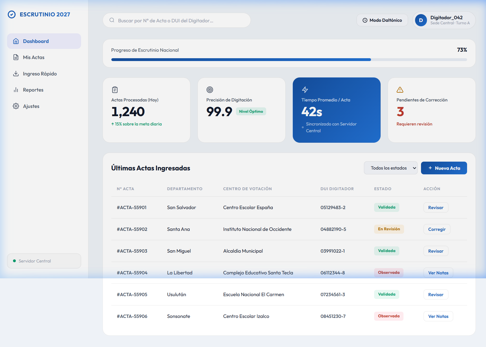

# 🗳️ Escrutinio 2027 — Dashboard de Digitación Masiva de Actas

> **Prototipo funcional** de un sistema de control interno diseñado para el proceso de escrutinio electoral. Resuelve el problema real de ingreso de alto volumen de actas (JRV) de forma eficiente, accesible y auditable.

[](https://developer.mozilla.org/es/docs/Web/HTML)
[](https://developer.mozilla.org/es/docs/Web/CSS)
[](#)
[](#)
[](https://enriquedev.github.io/escrutinio-2027-dashboard/)

---

## 🌐 Demo en Vivo

👉 **[Ver Demo en GitHub Pages](https://enriquedev.github.io/escrutinio-2027-dashboard/)**

---

## 🖼️ Vista Previa



*Dashboard institucional con Bento Grid adaptativo, modo daltónico accesible y tabla de gestión de actas.*

---

## 🚩 El Problema que Resuelve

Durante un proceso de escrutinio electoral, cientos de digitadores deben ingresar datos de **miles de actas de Juntas Receptoras de Votos (JRV)** en simultáneo. Los sistemas tradicionales:

- No muestran el progreso en tiempo real al operador.
- No tienen indicadores de precisión o alertas de error visibles.
- Carecen de modo accesible para personas con daltonismo.

Este **dashboard** provee una interfaz de digitación centralizada que muestra estadísticas clave, gestiona el estado de cada acta (Validada / En Revisión / Observada) y está optimizado para trabajo intensivo bajo presión.

---

## ✨ Características Destacadas

### 🎨 Diseño y UX
- **Bento Grid adaptativo** con `repeat(auto-fit, minmax())` — escala de 320px a monitores ultra anchos (≥ 2560px).
- **Dark Mode nativo** con paleta de color semántica vía variables CSS custom properties.
- Scrollbar personalizado con `::-webkit-scrollbar` y `scrollbar-color` (Firefox).
- Microinteracciones: hover en filas de tabla, botones y navegación.

### ♿ Accesibilidad
- HTML **semántico** (`<nav>`, `<header>`, `<section>`, `<table>`).
- Atributos **`scope="col"`** en encabezados de tabla (lectura correcta por lectores de pantalla).
- **`aria-label`** en todos los enlaces y controles interactivos.
- Textos SVG ocultos con `aria-hidden="true"` para íconos decorativos.
- Input de búsqueda con `font-size: 1rem` en móvil para **evitar zoom automático en iOS**.

### 🔵 Modo Daltónico
- Toggle activable desde la interfaz (`Modo Daltónico` → `Modo Normal`).
- Atajo de teclado: **`Alt + C`**.
- Implementado **exclusivamente con variables CSS** — sin JavaScript de color, sin imágenes adicionales.
- Paleta basada en el estándar **Wong (2011)** para daltonismo rojo-verde (deuteranopía/protanopía):
  - ✅ Éxito: `#0072B2` (azul)
  - ❌ Error: `#D55E00` (naranja-rojizo)
  - ⚠️ Advertencia: `#CC79A7` (rosado/púrpura)

### 📱 Responsividad Extrema (Edge Cases)
| Breakpoint | Comportamiento |
|---|---|
| `> 1600px` (ultra-wide) | `max-width` en `.main-wrapper` evita laguna de espacio; tarjetas con `max-width: 520px` |
| `≤ 1024px` (tablet / laptop) | Sidebar colapsa a barra de íconos (80px) |
| `≤ 768px` (móvil grande) | Sidebar migra a barra de navegación inferior fija |
| `≤ 480px` (320px – 479px) | `min-width: 560px` en `<table>` + scroll horizontal inercial (`-webkit-overflow-scrolling: touch`); header en columna; grid de una tarjeta |

---

## 🛠️ Tecnologías Utilizadas

| Tecnología | Uso |
|---|---|
| **HTML5** | Estructura semántica, ARIA, `scope` en tablas |
| **CSS3 Custom Properties** | Tematización (modo oscuro, modo daltónico) sin JS |
| **CSS Grid (`auto-fit`)** | Bento Grid fluido y responsivo |
| **Flexbox** | Layout de sidebar, header y control de actas |
| **Google Fonts (Outfit)** | Tipografía moderna de carga optimizada |
| **JavaScript vanilla** | Toggle daltónico, animación de contadores, búsqueda en vivo, filtro por estado |

> ⚡ **Sin frameworks. Sin librerías. Sin dependencias de node_modules.** Solo las APIs nativas del navegador.

---

## 📂 Estructura del Repositorio

```
escrutinio-2027-dashboard/
├── index.html          # Aplicación principal (entry point)
├── preview.png         # Captura de pantalla del dashboard
├── .gitignore          # Archivos ignorados por git
├── css/
│   └── style.css       # Estilos: variables, layout, breakpoints, modos
├── js/
│   └── main.js         # Lógica: daltónico, contadores, búsqueda, filtro
└── README.md           # Esta documentación
```

---

## 🚀 Cómo Usar Localmente

No requiere instalación ni servidor. Es un proyecto estático puro.

**1. Clonar el repositorio:**
```bash
git clone https://github.com/enriquedev/escrutinio-2027-dashboard.git
```

**2. Navegar a la carpeta:**
```bash
cd escrutinio-2027-dashboard
```

**3. Abrir en el navegador:**
```bash
# Opción A: doble clic sobre index.html en el explorador de archivos

# Opción B: desde la terminal (macOS/Linux)
open index.html

# Opción C: desde la terminal (Windows)
start index.html
```

> 💡 **Recomendado:** Usa la extensión **Live Server** de VS Code para recarga automática durante el desarrollo.

---

## 🔮 Estado del Proyecto y Próximos Pasos

- [x] Prototipo UI/UX completo
- [x] Responsividad full-range (320px → 2560px+)
- [x] Modo Daltónico accesible (paleta Wong 2011)
- [x] Búsqueda en vivo y filtro por estado
- [x] Animación de contadores con soporte `prefers-reduced-motion`
- [ ] Integración con API REST de backend (Node.js / Laravel)
- [ ] Autenticación de digitadores (JWT)
- [ ] Exportación de reportes en CSV / PDF

---

## 📄 Licencia

Distribuido bajo la licencia **MIT**. Libre para uso personal y educativo.

---

*Desarrollado como prototipo de sistema de control para procesos electorales — 2027.*
